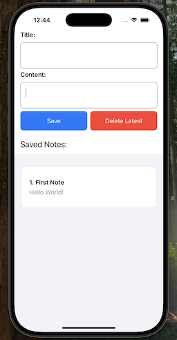

# Simple iOS note-taking app
A simple and lightweight iOS note-taking app built using **SwiftUI**. This app allows users to **create, view, and delete notes** efficiently with a minimalistic UI.

## 📱 App Screenshot


## Usage
Clone the repository and open the project in **Xcode**.

```sh
git clone https://github.com/takehika0129/no6-ios-note-taking-app.git
```

## Concept
[Visit (takehika0129.github.io)](https://takehika0129.github.io/takehika-github-pages/reviews/prototype6.html)

## License
You are free to use this code for personal and educational purposes. Commercial use and redistribution are not allowed.